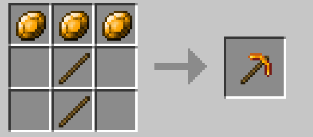

<head>
  <link rel="icon" href="/assets/favicon.ico" type="image/x-icon">
</head>

More Gems and Tools unveils a captivating realm of precious stones, each imbued with unique power. 

 
• Rubies - the most potent gems, bestow upon your tools incredible strength. 

 
• Topazes - slightly less durable, offer a balance of power and resilience. 

 
• Amethysts - less strong than other gems but also good

 Craft these gems into extraordinary tools, 
 
utilizing standard Minecraft crafting recipes, and embark on unforgettable journeys.

# Crafts:

<h2 style="color:red">Rubies</h2>

  
  
  

                                   **Ruby sword**                                  **Ruby pickaxe**                                **Ruby shovel**
     

    
    
    

    **Ruby axe left edition**                                  **ruby axe right edition**                    **ruby hoe left edition**

  
  
  

    **ruby hoe right edition**                        **ruby block to 9 rubies**                       **9 rubies to ruby block**

<h2 style="color:#f0ec11">Topazes</h2>

    
    
    

                                   **topaz sword**                                  **topaz pickaxe**                                **topaz shovel**

    
    
    

    **topaz axe left edition**                                  **topaz axe right edition**                    **ruby hoe left edition**

  
  
  

   **topaz hoe right edition**                        **topaz block to 9 topazes**                 **9 topazes to topaz block**

<h2 style="color:purple">Amethysts</h2>

    
    
    

                                   **amethyst sword**                                  **amethyst pickaxe**                                **amethyst shovel**
